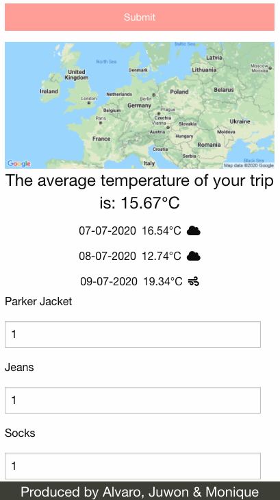

# Pack-My-Bags

An application that renders a list of items to pack, based on location, dates and weather forecast. 
Don't have those items available? That's not an issue, we have a link to take you shopping so you can have your items delivered ready for your trip. 

## User Story
AS A person who is going on a holiday 
I WANT weather results for my destination
THEN based on dates and average temperature
I WANT a list of clothing and items to take
THEN if I dont have that item
I WANT a link to purchase those items
SO THAT I have everything I appropriately need for my holiday

## Snippet Demonstration

When you open the application, you are presented with the home page.
 

Then, enter your location and select the dates you are travelling.
 

Once the dates are in, choose the type of travel you are taking to generate an appropriate clothing list.
 

On submit, you will be presented with a static map of your destination as well as a weather forecast for your trip and average trip temperature.
 

Now the list! Once you have submitted your form input, then based on the type of trip and the average weather conditions, you will be presented with a list of suggested clothing to pack. You can alter the item count depending on how many of that item you want to pack. 
 

You're done! Click "Pack My Bags" to render your list of items to pack. 
 

### Deployed URL:
https://mloibner.github.io/Pack-My-Bags/

### Creators
Created by: 
Alvaro Fernandes - Main JS script writer and researcher
Juwon Hong - Main CSS stylesheet writer and design lead
Monique Loibner - Main researcher, HTML writer and design lead

#### MIT License

Copyright (c) [2020] [Monique Loibner & Alvaro Fernandes & Juwon Hong]

Permission is hereby granted, free of charge, to any person obtaining a copy
of this software and associated documentation files (the "Software"), to deal
in the Software without restriction, including without limitation the rights
to use, copy, modify, merge, publish, distribute, sublicense, and/or sell
copies of the Software, and to permit persons to whom the Software is
furnished to do so, subject to the following conditions:

The above copyright notice and this permission notice shall be included in all
copies or substantial portions of the Software.

THE SOFTWARE IS PROVIDED "AS IS", WITHOUT WARRANTY OF ANY KIND, EXPRESS OR
IMPLIED, INCLUDING BUT NOT LIMITED TO THE WARRANTIES OF MERCHANTABILITY,
FITNESS FOR A PARTICULAR PURPOSE AND NONINFRINGEMENT. IN NO EVENT SHALL THE
AUTHORS OR COPYRIGHT HOLDERS BE LIABLE FOR ANY CLAIM, DAMAGES OR OTHER
LIABILITY, WHETHER IN AN ACTION OF CONTRACT, TORT OR OTHERWISE, ARISING FROM,
OUT OF OR IN CONNECTION WITH THE SOFTWARE OR THE USE OR OTHER DEALINGS IN THE
SOFTWARE.

